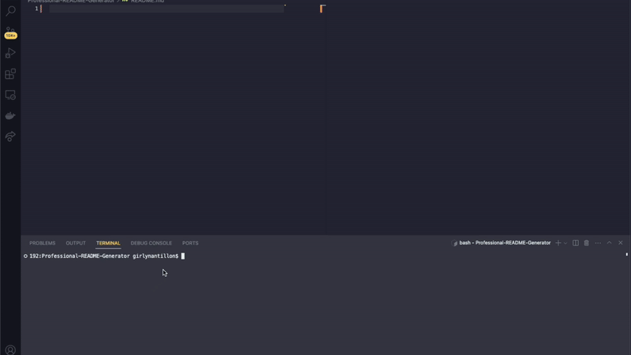

# Professional README Generator
[](https://opensource.org/licenses/MIT)

## Description
The Professional README Generator is a command-line tool designed to simplify the process of creating README.md files for your projects. Instead of manually writing and formatting the README file, this tool automates the process based on the information you provide.

## Table of Contents
- [Installation](#installation)
- [Usage](#usage)
- [License](#license)
- [Contributing](#contributing)
- [Screen Recording](#screen-recording)
- [Questions](#questions)

## Installation
````
npm install --save inquirer@^8.0.0
````

## Usage
The application will be invoked by using the following command:
````
node index.js
````

## License
This project is licensed under the [MIT License](LICENSE).

## Contributing
Contributions are welcome! If you find any issues or have suggestions for improvement, please open an issue or create a pull request.

## Screen Recording

Link to the [Walkthrough Video](https://drive.google.com/file/d/1J13-Mlp4d1VuWfZO6ru96r96UU2GVe0f/view)



## Questions
Follow me on Github at https://github.com/caseygirlyn.

Feel free to reach out to me for any inquiries at [casey.girlyn@gmail.com](mailto:casey.girlyn@gmail.com).

[](https://www.buymeacoffee.com/caseygirlyn)
[](https://www.npmjs.com/)
[](https://nodejs.org/)
